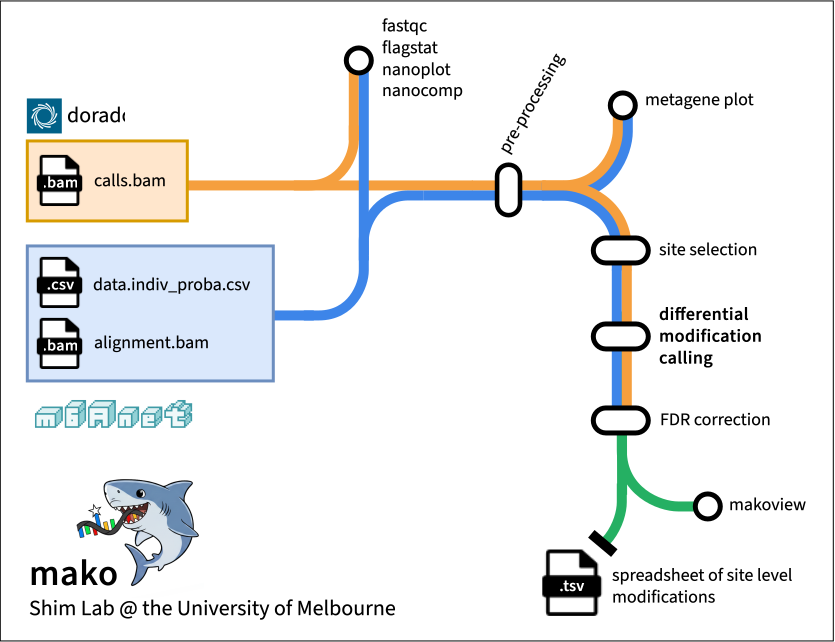

Mako is a bioinformatics pipeline designed for differential RNA modification analysis at the isoform resolution using Nanopore direct RNA sequencing. It takes a samplesheet and output from Dorado and/or m6Anet, and applies various statistical methods to identify differentially modified sites between experimental conditions.

Mako will also produce interactive visualisations for quality control and assessment of sites through the `makoview` tool.

The software is written in Nextflow and utilises Docker/Singularity containerisation for reproducibility and ease of installation.

!!! tip
    See [Usage](usage.md) for instructions on how to install and run the pipeline.

## Steps of the pipeline

1. Sample and read QC
2. Site-level aggregation, filtering, and selection
3. Choice of differential analysis methods:
    1. Either binomial or beta-binomial, depending on the dispersion (**default**)
    2. Binomial
    3. Beta-binomial
4. False discovery rate correction
5. Visualization of results via *makoview*

---

---