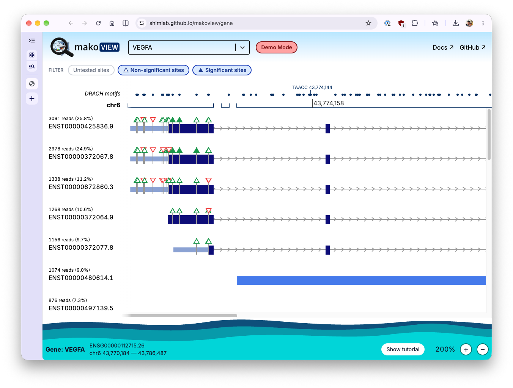

Mako comes with an interactive application called **_Makoview_** which can be used to visualise the results once the pipeline has finished. You can see an interactive demo of Makoview here: [https://shimlab.github.io/makoview/gene](https://shimlab.github.io/makoview/gene).



## Install
Makoview is automatically installed by the Mako pipeline into a virtual environment. Once the execution has completed, run:
```sh
$ <results_dir>/makoview/launch_makoview.sh
```

## Running on HPC

On HPC systems, if you have SSH access, you can port forward the web server from the server to your local machine.

It is recommended that you run Makoview from your HPC system's login node.

### 1. Start Makoview on HPC
```console title="🏢 HPC shell"
[userX@hpc-login-node]$ ./makoview/launch_makoview.sh

INFO:     Started server process [18394]
INFO:     Waiting for application startup.

... abridged ...

============================================================
  Makoview is running on http://127.0.0.1:52348

  Tip: advice on accessing Makoview from other devices
       using SSH port forwarding can be found in the docs:
       https://shimlab.github.io/mako/makoview
============================================================

```

### 2. Port forward the HPC port
Replace "52348" with the port that Makoview is running on. Keep this ssh process running in the background.

```console title="💻 Client device"
[userX@user-client]$ ssh -NL 52348:localhost:52348 userX@hpc-login-node
```

### 3. Open Makoview
Visit a browser on your client device and navigate to localhost:52348, or the correct port.

### Manual installation and usage

!!! warning
    Makoview depends on the output produced by Mako and is automatically installed by the Mako pipeline into a virtual environment. Run Makoview manually at your own risk!

<details>
<summary>Show details</summary>
makoview is a Python package for Python 3.9 — 3.12.12, available on PyPI and downloadable through your preferred Python package manager.

```bash
# with pip:
$ pip install makoview
$ makoview --help

# with pipx:
$ pipx run makoview --help

# using uvx (✅ recommended!!)
$ uvx makoview --help        # or uvx --python 3.12 makoview --help
```

[`pipx`](https://github.com/pypa/pipx) and [`uv`](https://docs.astral.sh/uv/) allow executables to be run within their own isolated environment, preventing dependency resolution issues. They are recommended over `pip install`.

Makoview provides two subcommands: `init` (to index references) and `serve` (to launch the server). The server takes the following parameters:

```bash
options:
  -h, --help            show this help message and exit
  --genome GENOME       Path to genome reference fasta
  --gtf_db GTF_DB       Path to GTF database file
  --sites SITES         Path to sites.duckdb
  --coverage COVERAGE   Path to coverage.duckdb
  --reads READS         Path to reads.duckdb
  --fits FITS           Path to model calls file (model_calls.tsv)
  --modified_prob_threshold MODIFIED_PROB_THRESHOLD
                        Probability threshold above which a site is considered modified
  --port PORT           Port for the application server (default: 8001)
  --host HOST           Host address (default: 127.0.0.1)
```

The default usage is as follows:

```bash
export MAKO_OUTPUT_DIR="<path/to/results>"
export REFERENCE_GENOME="<path/to/genome.fa>"
export MOD_THRESHOLD=0.5

makoview serve \
  --genome   $REFERENCE_GENOME \
  --gtf_db   $MAKO_OUTPUT_DIR/db/gtf_features.duckdb \
  --sites    $MAKO_OUTPUT_DIR/differential/sites.duckdb \
  --coverage $MAKO_OUTPUT_DIR/db/coverage.duckdb \
  --reads    $MAKO_OUTPUT_DIR/db/reads.duckdb \
  --fits     $MAKO_OUTPUT_DIR/differential/model_calls.tsv \
  --port     52348 \
  --modified_prob_threshold $MOD_THRESHOLD
```

This will launch a web server running on port `52348`.

</details>