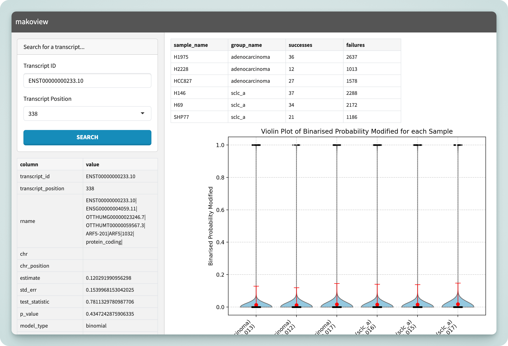

Mako comes with an interactive application called **_makoview_** which can be used to visualise the results once the pipeline has finished.



## Installation

makoview is a Python package for Python 3.9 — 3.12.12, available on PyPI and downloadable through your preferred Python package manager.

```bash
# with pip:
$ pip install makoview
$ makoview --help

# with pipx:
$ pipx run makoview --help

# using uvx (✅ recommended!!)
$ uvx makoview --help        # or uvx --python 3.12 makoview --help
```

[`pipx`](https://github.com/pypa/pipx) and [`uv`](https://docs.astral.sh/uv/) allow executables to be run within their own isolated environment, preventing dependency resolution issues. They are recommended over `pip install`.

## Usage

Makoview has three parameters:

```bash
options:
  -h, --help            show this help message and exit
  --differential-results DIFFERENTIAL_RESULTS
                        Path to differential sites database file
  --modification-db MODIFICATION_DB
                        Path to modification database file
  --port PORT           Port for the Shiny application (default: 8000)
```

The default usage is as follows:

```bash
export MAKO_OUTPUT_DIR="/data/gpfs/projects/punim0614/occheng/epi_differential/pipeline/runs/longbench/results"
export MODCALLER="dorado"  # either "dorado" or "m6anet"
export DIFFERENTIAL_MODEL="adaptive_binomial"
makoview \
  --differential-results $MAKO_OUTPUT_DIR/differential/$MODCALLER/${DIFFERENTIAL_MODEL}_fits.tsv \
  --modification-db $MAKO_OUTPUT_DIR/modcall/$MODCALLER/all_sites.duckdb \
  --port 8000
```

This will launch a web server running on port `8000`, accessible at [http://127.0.0.1:8000](http://127.0.0.1:8000).

### Running on HPC

On HPC systems, if you have SSH access, you can port forward the web server from the server to your local machine.

```bash
# launch the server on port within [10000, 65535], i.e.
🛜 SERVER $ makoview <params> --port <abcde>

# next, on your local machine, forward that port:
👩‍💻 CLIENT $ ssh -N -L <abcde>:localhost:<abcde> username@hpc.server
```

You can now connect to Makoview locally using `http://127.0.0.1:<abcde>`.
